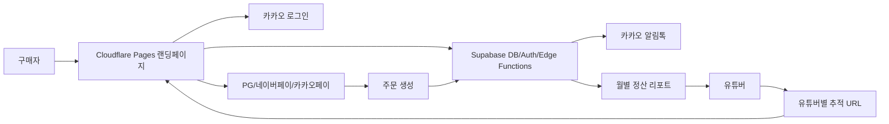
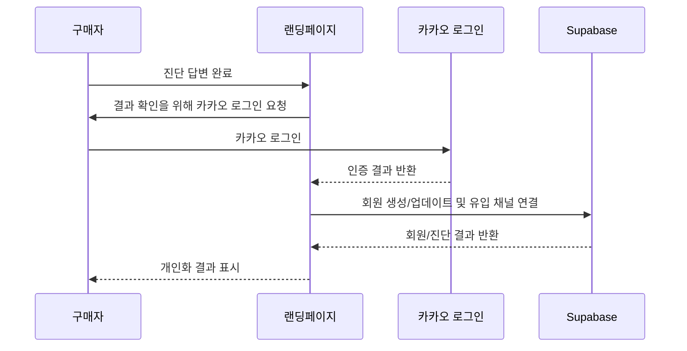
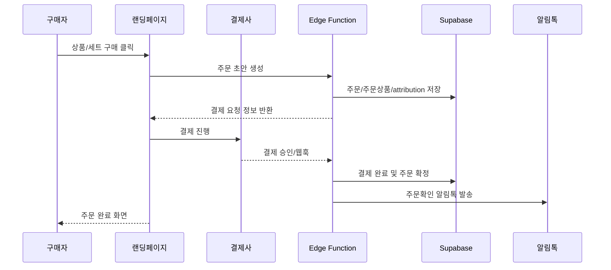
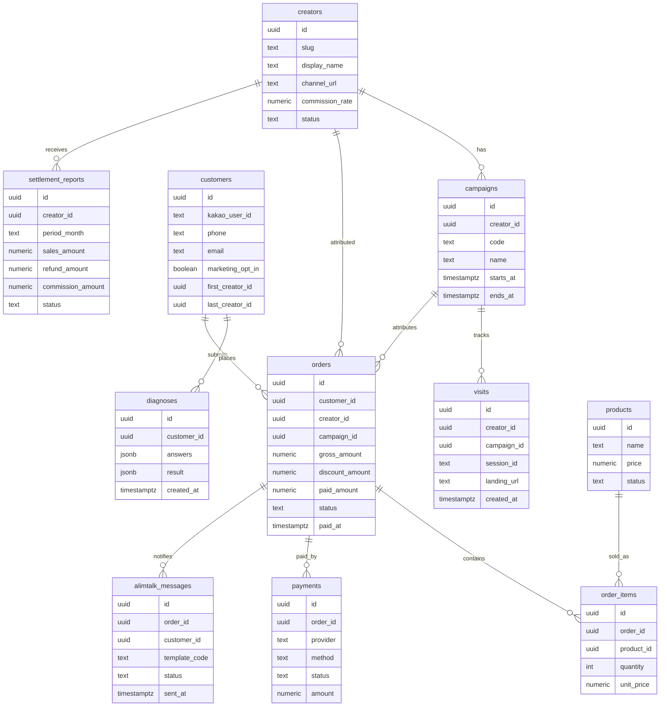
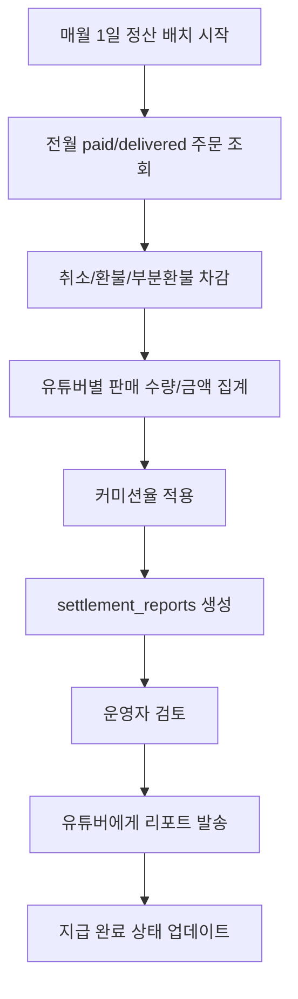

# High Level Design - 유튜버 제휴 건강기능식품 랜딩페이지

## 1. 목적

이 문서는 유튜버별 전용 유입 경로를 통해 건강기능식품을 판매하는 랜딩페이지와 그 주변 시스템의 하이레벨 디자인을 정의한다.

기존 화면은 Figma UI AI/Figma Make로 생성된 모바일 중심 랜딩페이지이며, 앞으로는 단순 상품 소개 페이지가 아니라 유튜버 제휴 판매, 회원 구매 추적, 카카오 로그인, 결제, 알림톡 CRM, 월별 정산 리포트를 포함하는 커머스 퍼널로 확장한다.

## 2. 핵심 요구사항

1. 유튜버별 유입 경로를 분리하고, URL 파라미터로 유튜버 채널 데이터를 추적한다.
2. 사용자는 카카오톡 계정으로 로그인한다.
3. 결제는 PG사 카드결제, 네이버페이, 카카오페이, 기타 간편결제를 포함한다.
4. 카카오 알림톡으로 주문확인, 배송안내, 재구매 CRM 메시지를 발송한다.
5. 랜딩페이지 안에서 자연스럽게 CRM 정보를 수집하고, 진단 결과 확인은 카카오 로그인이 필요하다.
6. 데이터베이스는 Supabase를 사용한다.
7. 배포는 Cloudflare를 사용한다.
8. 유튜버 채널별 판매 수량, 판매 금액, 월별 정산 리포트를 자동 생성하고 유튜버에게 정산한다.

## 3. 제품 관점 요약

이 서비스의 핵심은 유튜버가 자신의 구독자에게 건강기능식품 랜딩페이지를 공유하고, 구독자가 해당 링크를 통해 진단, 로그인, 구매까지 진행하는 구조다.

사용자는 유튜버의 추천을 신뢰하고 들어온다. 따라서 랜딩페이지는 다음 역할을 해야 한다.

- 유튜버별 유입을 정확히 식별한다.
- 건강 진단 또는 혜택 신청을 통해 자연스럽게 CRM 동의를 확보한다.
- 진단 결과는 카카오 로그인을 통해 제공해 회원 전환을 유도한다.
- 구매 발생 시 어떤 유튜버 채널에서 발생한 매출인지 저장한다.
- 주문, 배송, 재구매 안내를 카카오 알림톡으로 이어간다.
- 월 단위로 유튜버별 정산 자료를 생성한다.

## 4. 사용자 및 운영자

### 일반 구매자

- 유튜버 영상, 쇼츠, 커뮤니티, 설명란 링크를 통해 랜딩페이지에 진입한다.
- 건강 진단 또는 상품 추천을 확인한다.
- 카카오 로그인을 통해 결과를 확인한다.
- 추천 상품 또는 세트 상품을 구매한다.
- 주문/배송/재구매 안내를 카카오 알림톡으로 받는다.

### 유튜버

- 본인 전용 랜딩 URL 또는 추적 파라미터를 받는다.
- 자신의 채널을 통해 상품을 홍보한다.
- 월별 판매 수량, 판매 금액, 정산 금액 리포트를 받는다.
- 정산 기준에 따라 수수료 또는 커미션을 지급받는다.

### 운영자

- 유튜버 채널 정보를 등록한다.
- 상품, 세트, 가격, 혜택, CRM 메시지를 관리한다.
- 주문, 결제, 배송, 환불 상태를 확인한다.
- 월별 정산 리포트를 검토하고 지급 처리한다.

## 5. 전체 시스템 컨텍스트



## 6. 권장 아키텍처

### Frontend

- Vite + React + Tailwind CSS 기반 랜딩페이지
- Cloudflare Pages 배포
- 유튜버 파라미터 수집 및 저장
- 건강 진단 퍼널
- 카카오 로그인 진입
- 상품/세트 구매 CTA

### Backend

- Supabase Postgres: 핵심 데이터 저장
- Supabase Auth 또는 외부 카카오 OAuth 연동: 회원 식별
- Supabase Edge Functions: 결제 콜백 처리, 알림톡 발송, 정산 리포트 생성
- Supabase Scheduled Functions 또는 Cloudflare Cron Triggers: 월별 정산 배치

### External Services

- Kakao Login: 회원 인증
- Kakao Alimtalk: 주문확인, 배송안내, 재구매 CRM
- PG사: 카드결제 및 일반 결제
- Naver Pay: 간편결제
- Kakao Pay: 간편결제
- Cloudflare: 정적 배포, CDN, 라우팅, 필요 시 Worker API

## 7. 유튜버별 유입 추적 설계

### URL 구조

유튜버별 링크는 다음 중 하나를 권장한다.

```text
https://example.com/?creator=creator_slug&utm_source=youtube&utm_medium=influencer&utm_campaign=campaign_id
https://example.com/c/creator_slug?campaign=campaign_id
```

초기 구현은 쿼리 파라미터 방식이 단순하다. 운영 규모가 커지면 `/c/{creator_slug}` 형태의 라우팅을 추가할 수 있다.

### 추적 파라미터

- `creator`: 유튜버 식별자
- `campaign`: 캠페인 식별자
- `utm_source`: 기본값 `youtube`
- `utm_medium`: 기본값 `influencer`
- `utm_campaign`: 광고/콘텐츠 캠페인명
- `content_id`: 영상, 쇼츠, 커뮤니티 글 등 콘텐츠 단위 식별자

### 추적 방식

1. 랜딩 진입 시 URL 파라미터를 읽는다.
2. `creator`와 `campaign`을 검증한다.
3. 브라우저 localStorage 또는 cookie에 attribution 정보를 저장한다.
4. 카카오 로그인 후 회원 프로필에 최초 유입 채널과 최근 유입 채널을 연결한다.
5. 주문 생성 시 해당 attribution snapshot을 주문에 복사한다.

주문 시점에 attribution snapshot을 저장해야 이후 유튜버명이 변경되거나 캠페인이 종료되어도 정산 근거가 흔들리지 않는다.

## 8. 카카오 로그인 설계

진단 결과 확인, CRM 수신 동의, 구매 내역 조회는 카카오 로그인을 기준으로 제공한다.

### 로그인 흐름



### 저장할 회원 정보

- 카카오 고유 식별자
- 휴대전화번호 또는 알림톡 발송 가능 식별 정보
- 닉네임
- 이메일, 선택 정보
- 마케팅 수신 동의 여부
- 개인정보 처리 동의 이력
- 최초 유입 유튜버
- 최근 유입 유튜버

카카오에서 제공받는 항목은 실제 심사/동의 항목에 따라 달라질 수 있으므로, 구현 전 카카오 개발자 콘솔의 동의 항목을 확정해야 한다.

## 9. CRM 퍼널 설계

랜딩페이지는 구매 전 CRM 데이터를 자연스럽게 모으는 퍼널을 포함해야 한다.

### 권장 퍼널

1. Hero CTA: “내게 맞는 영양제 찾기”
2. 건강 상태 진단: 5개 내외 질문
3. 결과 미리보기: 핵심 결과 일부 blur 처리
4. 카카오 로그인: “결과 전체 보기”
5. 결과 화면: 추천 성분, 추천 상품, 세트 제안
6. 혜택 수신 동의: 할인 쿠폰, 재구매 알림, 배송 안내
7. 구매 CTA

### 수집 가능한 CRM 데이터

- 진단 답변
- 관심 건강 카테고리
- 추천 상품 클릭
- 장바구니 또는 결제 시도
- 구매 완료
- 재구매 가능 시점
- 알림톡 수신 동의

진단 결과 확인을 로그인 뒤로 배치하면 회원 전환율과 CRM 수집률을 높일 수 있다.

## 10. 결제 설계

결제 수단은 PG사 카드결제, 네이버페이, 카카오페이, 기타 간편결제를 포함한다.

### 결제 흐름



### 결제 상태

- `draft`: 주문 초안
- `payment_pending`: 결제 대기
- `paid`: 결제 완료
- `payment_failed`: 결제 실패
- `cancelled`: 주문 취소
- `refunded`: 환불 완료
- `shipping`: 배송 중
- `delivered`: 배송 완료

정산은 원칙적으로 `paid` 이후 배송/환불 정책을 반영한 확정 매출 기준으로 계산한다.

## 11. 카카오 알림톡 설계

알림톡은 거래성 메시지와 CRM 메시지로 분리한다.

### 거래성 알림톡

- 주문확인
- 결제완료
- 배송시작
- 배송완료
- 환불/취소 안내

### CRM 알림톡

- 진단 결과 기반 추천 상품 안내
- 복용 주기 기반 재구매 리마인드
- 유튜버 전용 혜택 안내
- 장바구니 또는 결제 이탈 리마인드

CRM성 메시지는 수신 동의, 발송 시간, 발송 빈도, 수신 거부 정책을 명확히 관리해야 한다.

## 12. Supabase 데이터 모델 초안



### Supabase 보안 원칙

- 공개 클라이언트에는 service role key를 절대 노출하지 않는다.
- 공개 schema table에는 RLS를 활성화한다.
- 주문, 결제, 정산, 알림톡 발송은 Edge Function 또는 서버 권한에서 처리한다.
- 유튜버별 리포트 조회는 본인 데이터만 볼 수 있도록 별도 권한 정책을 둔다.
- 결제 웹훅 검증, 알림톡 발송, 정산 생성 함수는 public client에서 직접 호출하지 않도록 보호한다.

## 13. Cloudflare 배포 설계

### 권장 구성

- Cloudflare Pages: React 랜딩페이지 정적 배포
- Cloudflare Workers: 필요한 경우 짧은 API proxy 또는 라우팅 처리
- Cloudflare CDN: 이미지와 정적 asset 캐싱
- Cloudflare Web Analytics: 기본 트래픽 분석
- Cloudflare Cron Triggers: 월별 정산 작업 트리거 후보

초기에는 Cloudflare Pages + Supabase Edge Functions 조합이 단순하다. 결제 웹훅과 알림톡 발송은 Supabase Edge Functions에 두는 것이 DB 접근과 권한 관리 측면에서 자연스럽다.

## 14. 월별 정산 리포트 설계

### 정산 기준

정산은 유튜버별 `creator_id`가 연결된 주문을 기준으로 집계한다.

기본 집계 항목:

- 기간
- 유튜버 ID
- 유튜버명
- 캠페인별 주문 수
- 판매 수량
- 총 결제 금액
- 취소/환불 금액
- 정산 대상 금액
- 수수료율
- 정산 금액
- 지급 상태

### 정산 흐름



### 리포트 제공 방식

초기에는 운영자가 CSV 또는 PDF로 내려받아 전달할 수 있다. 이후에는 유튜버 전용 대시보드를 제공해 월별 리포트를 직접 확인하게 할 수 있다.

## 15. 랜딩페이지 화면 구성 업데이트

기존 화면 섹션은 유지하되, 다음을 추가하거나 의미를 조정한다.

### Header

- 브랜드 로고
- 카카오 로그인
- 유튜버 전용 혜택 표시 가능

### Hero

- 유튜버 추천 문구 표시
- 예: “OOO님 구독자 전용 건강 루틴”
- 유튜버 파라미터가 있을 때 creator display name 또는 campaign benefit 표시

### Health Diagnosis

- CRM 퍼널의 핵심
- 결과 일부를 미리 보여주고 전체 결과는 카카오 로그인 뒤 제공
- 진단 답변은 로그인 전 session에 임시 저장하고, 로그인 후 customer에 연결

### Product Lineup

- 추천 상품 4종
- 진단 결과에 따라 추천 순서 변경 가능
- 유튜버 전용 할인 또는 혜택 badge 표시 가능

### Set Configuration

- 객단가 상승을 위한 세트 제안
- 유튜버별 캠페인 할인율 반영 가능

### Trust

- 판매량, 리뷰, 입점처
- 유튜버 추천 신뢰와 브랜드 신뢰를 함께 보여준다.

### Purchase CTA

- PG사 결제
- 네이버페이
- 카카오페이
- 기타 간편결제

### Footer

- 사업자 정보
- 개인정보처리방침
- 마케팅 수신 동의 안내
- 유튜버 제휴/광고 고지 문구

## 16. 주요 리스크 및 의사결정 필요사항

### Attribution 정책

여러 유튜버 링크를 방문한 사용자가 구매할 경우 어떤 유튜버에게 매출을 귀속할지 결정해야 한다.

권장 기본값:

- 최초 유입 creator 저장
- 최근 유입 creator 저장
- 주문 정산은 최근 유입 creator 기준
- 단, 캠페인 정책에 따라 최초 유입 기준으로 변경 가능

### 결제/환불 정산 정책

정산 대상 금액을 결제 완료 기준으로 할지, 배송 완료 기준으로 할지 결정해야 한다.

권장 기본값:

- 결제 완료 후 배송 완료 또는 환불 가능 기간 경과 주문을 정산 확정 대상으로 사용

### 알림톡 수신 동의

거래성 알림과 마케팅성 CRM 알림은 동의 기준이 다르다. CRM 메시지는 명시적인 마케팅 수신 동의와 수신 거부 경로가 필요하다.

### 개인정보 및 건강 정보

진단 답변은 건강 관련 민감한 맥락을 가질 수 있다. 최소 수집, 목적 고지, 보관 기간, 삭제 요청 정책을 정리해야 한다.

## 17. 단계별 구현 로드맵

### Phase 1: 랜딩페이지 복구 및 기본 추적

- 깨진 한국어 카피와 JSX 문법 복구
- `creator`, `campaign`, UTM 파라미터 수집
- session/localStorage attribution 저장
- Supabase 기본 schema 초안 생성
- Cloudflare Pages 배포

### Phase 2: 카카오 로그인 및 CRM 퍼널

- 카카오 로그인 연동
- 진단 질문 5문항 구현
- 로그인 후 진단 결과 제공
- 고객 프로필과 유입 채널 연결
- 마케팅 수신 동의 저장

### Phase 3: 결제 및 주문 처리

- 주문 초안 생성
- PG/네이버페이/카카오페이 연동
- 결제 승인 웹훅 처리
- 주문/결제/주문상품 저장
- 주문확인 알림톡 발송

### Phase 4: 배송/재구매 CRM

- 배송 상태 업데이트
- 배송안내 알림톡 발송
- 구매 주기 기반 재구매 CRM
- 장바구니/결제 이탈 리마인드

### Phase 5: 정산 리포트

- 유튜버별 월별 판매 집계
- 취소/환불 차감
- 커미션 계산
- settlement report 생성
- 운영자 검토 및 지급 상태 관리
- 유튜버용 리포트 제공

## 18. 성공 기준

- 유튜버별 URL로 들어온 방문과 구매가 정확히 연결된다.
- 카카오 로그인 후 진단 결과가 제공된다.
- 결제 완료 주문에 유튜버 attribution snapshot이 저장된다.
- 주문확인, 배송안내, 재구매 CRM 알림톡이 발송된다.
- 월별로 유튜버별 판매 수량, 판매 금액, 정산 금액을 산출할 수 있다.
- 운영자는 정산 근거를 주문 단위로 추적할 수 있다.
- 구매자는 모바일에서 자연스럽게 진단, 로그인, 구매까지 진행할 수 있다.

## 19. 결론

이 프로젝트는 단순 랜딩페이지보다 유튜버 제휴 판매 채널을 운영하기 위한 커머스 퍼널에 가깝다. 가장 중요한 설계 포인트는 유튜버 attribution을 방문, 회원, 주문, 정산까지 끊기지 않게 연결하는 것이다.

초기 구현은 Cloudflare Pages에 랜딩페이지를 배포하고, Supabase에 고객, 유튜버, 캠페인, 주문, 결제, 알림톡, 정산 데이터를 저장하는 구조가 적합하다. 이후 카카오 로그인, 결제사 연동, 알림톡, 월별 정산 배치를 단계적으로 붙이면 운영 가능한 유튜버 제휴 커머스 시스템으로 확장할 수 있다.
