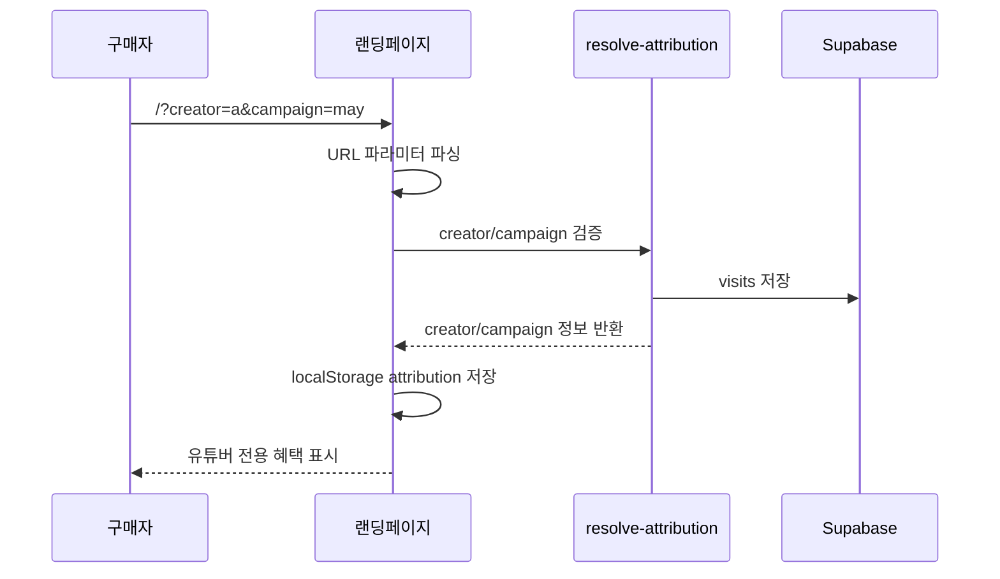
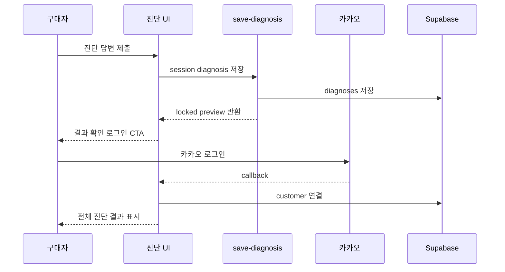
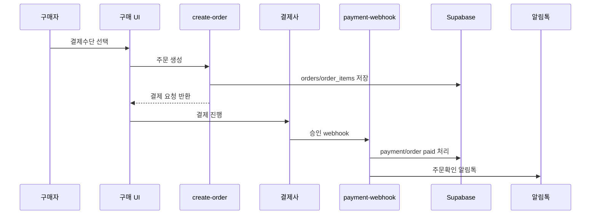

# Low Level Design - 유튜버 제휴 건강기능식품 랜딩페이지

## 1. 문서 목적

이 문서는 `HIGH_LEVEL_DESIGN.md`를 구현 가능한 수준으로 구체화한 로우레벨 디자인 문서다. 범위는 유튜버별 유입 추적, 카카오 로그인, 건강 진단 CRM 퍼널, 주문/결제, 알림톡, Supabase 데이터 모델, Cloudflare 배포, 월별 정산 리포트까지 포함한다.

현재 저장소는 Vite + React + Tailwind CSS 기반 Figma Make 산출물이다. 이 문서는 기존 화면을 실제 서비스로 확장할 때 필요한 파일 구조, 데이터베이스 테이블, API, 프론트 상태, 배치 작업, 보안 정책을 정의한다.

## 2. 구현 전제

- Frontend: Vite, React, TypeScript, Tailwind CSS
- Hosting: Cloudflare Pages
- Database: Supabase Postgres
- Server Functions: Supabase Edge Functions 우선
- Auth: 카카오 로그인 기반
- Payment: PG사, 네이버페이, 카카오페이
- Notification: 카카오 알림톡
- Attribution: 주문 시점의 유튜버/캠페인 snapshot 저장

## 3. 권장 디렉터리 구조

```text
src/
├─ app/
│  ├─ App.tsx
│  ├─ routes/
│  │  ├─ LandingPage.tsx
│  │  ├─ DiagnosisResultPage.tsx
│  │  └─ OrderCompletePage.tsx
│  ├─ sections/
│  │  ├─ Header.tsx
│  │  ├─ HeroSection.tsx
│  │  ├─ DiagnosisSection.tsx
│  │  ├─ ProductLineupSection.tsx
│  │  ├─ SetConfigurationSection.tsx
│  │  ├─ TrustSection.tsx
│  │  ├─ PurchaseCtaSection.tsx
│  │  └─ Footer.tsx
│  ├─ components/
│  │  ├─ attribution/
│  │  ├─ diagnosis/
│  │  ├─ payment/
│  │  └─ ui/
│  ├─ data/
│  │  ├─ diagnosisQuestions.ts
│  │  └─ staticProducts.ts
│  ├─ lib/
│  │  ├─ attribution.ts
│  │  ├─ kakaoAuth.ts
│  │  ├─ supabaseClient.ts
│  │  ├─ payment.ts
│  │  └─ analytics.ts
│  └─ types/
│     ├─ attribution.ts
│     ├─ customer.ts
│     ├─ order.ts
│     └─ product.ts
└─ styles/
```

초기 구현에서는 파일을 모두 만들 필요는 없다. 우선순위는 `lib/attribution.ts`, `lib/supabaseClient.ts`, `sections/DiagnosisSection.tsx`, `sections/PurchaseCtaSection.tsx` 순서다.

## 4. 환경 변수

### Cloudflare Pages

```text
VITE_SUPABASE_URL=
VITE_SUPABASE_PUBLISHABLE_KEY=
VITE_KAKAO_CLIENT_ID=
VITE_KAKAO_REDIRECT_URI=
VITE_APP_BASE_URL=
```

브라우저에 노출되는 값은 publishable key만 사용한다. Supabase service role key, PG secret, 알림톡 API key는 절대 `VITE_` 환경 변수로 두지 않는다.

### Supabase Edge Functions

```text
SUPABASE_URL=
SUPABASE_SERVICE_ROLE_KEY=
KAKAO_REST_API_KEY=
KAKAO_CLIENT_SECRET=
PG_SECRET_KEY=
NAVER_PAY_SECRET=
KAKAO_PAY_SECRET=
ALIMTALK_API_KEY=
ALIMTALK_SENDER_KEY=
SETTLEMENT_REPORT_RECIPIENT=
```

## 5. Frontend 상태 설계

### Attribution State

```ts
type AttributionState = {
  creatorSlug?: string;
  creatorId?: string;
  campaignCode?: string;
  campaignId?: string;
  utmSource?: string;
  utmMedium?: string;
  utmCampaign?: string;
  contentId?: string;
  landingUrl: string;
  referrer?: string;
  firstSeenAt: string;
  lastSeenAt: string;
};
```

저장 위치:

- `localStorage`: attribution 유지
- `sessionStorage`: 로그인 전 진단 답변 임시 저장
- Supabase `visits`: 서버 저장 방문 기록

### Diagnosis State

```ts
type DiagnosisAnswer = {
  questionId: string;
  optionId: string;
  score?: number;
};

type DiagnosisSession = {
  sessionId: string;
  answers: DiagnosisAnswer[];
  resultPreview?: DiagnosisResultPreview;
  completedAt?: string;
};
```

### Auth State

```ts
type AuthState = {
  isAuthenticated: boolean;
  customerId?: string;
  kakaoUserId?: string;
  marketingOptIn: boolean;
};
```

## 6. 유튜버 Attribution 상세 설계

### URL 파라미터 파서

대상 파라미터:

- `creator`
- `campaign`
- `utm_source`
- `utm_medium`
- `utm_campaign`
- `content_id`

동작:

1. 앱 최초 로드 시 `window.location.search`를 파싱한다.
2. `creator`가 있으면 Supabase 또는 Edge Function으로 유효성 검증한다.
3. 유효한 attribution이면 localStorage에 저장한다.
4. 기존 attribution이 있고 새 creator가 들어오면 `last_*` 값을 갱신한다.
5. 로그인 또는 주문 시 attribution snapshot을 서버로 보낸다.

### Attribution 저장 정책

```ts
const ATTRIBUTION_STORAGE_KEY = "picknpill_attribution";
const ATTRIBUTION_TTL_DAYS = 30;
```

기본 정책:

- 최초 유입: `first_creator_id`
- 최근 유입: `last_creator_id`
- 주문 귀속: 최근 유입 기준
- TTL: 30일

주문 테이블에는 `creator_id`, `campaign_id`뿐 아니라 `attribution_snapshot` JSON을 저장한다.

## 7. Supabase Schema 상세 설계

모든 public table은 RLS를 활성화한다. 민감한 주문/결제/정산 처리는 Edge Function에서 service role로 수행한다.

### Enum

```sql
create type creator_status as enum ('active', 'paused', 'archived');
create type campaign_status as enum ('draft', 'active', 'ended', 'paused');
create type order_status as enum (
  'draft',
  'payment_pending',
  'paid',
  'payment_failed',
  'cancelled',
  'refunded',
  'shipping',
  'delivered'
);
create type payment_status as enum ('pending', 'approved', 'failed', 'cancelled', 'refunded');
create type alimtalk_status as enum ('queued', 'sent', 'failed', 'cancelled');
create type settlement_status as enum ('draft', 'reviewing', 'approved', 'paid', 'cancelled');
```

### creators

```sql
create table public.creators (
  id uuid primary key default gen_random_uuid(),
  slug text not null unique,
  display_name text not null,
  channel_url text,
  contact_email text,
  contact_phone text,
  commission_rate numeric(5, 2) not null default 0,
  status creator_status not null default 'active',
  created_at timestamptz not null default now(),
  updated_at timestamptz not null default now()
);
```

Index:

```sql
create index creators_status_idx on public.creators (status);
```

### campaigns

```sql
create table public.campaigns (
  id uuid primary key default gen_random_uuid(),
  creator_id uuid not null references public.creators(id),
  code text not null unique,
  name text not null,
  benefit_label text,
  discount_rate numeric(5, 2) default 0,
  status campaign_status not null default 'draft',
  starts_at timestamptz,
  ends_at timestamptz,
  created_at timestamptz not null default now(),
  updated_at timestamptz not null default now()
);
```

Index:

```sql
create index campaigns_creator_id_idx on public.campaigns (creator_id);
create index campaigns_status_idx on public.campaigns (status);
```

### customers

```sql
create table public.customers (
  id uuid primary key default gen_random_uuid(),
  auth_user_id uuid unique,
  kakao_user_id text unique,
  phone text,
  email text,
  nickname text,
  marketing_opt_in boolean not null default false,
  marketing_opt_in_at timestamptz,
  first_creator_id uuid references public.creators(id),
  last_creator_id uuid references public.creators(id),
  first_campaign_id uuid references public.campaigns(id),
  last_campaign_id uuid references public.campaigns(id),
  created_at timestamptz not null default now(),
  updated_at timestamptz not null default now()
);
```

### visits

```sql
create table public.visits (
  id uuid primary key default gen_random_uuid(),
  session_id text not null,
  customer_id uuid references public.customers(id),
  creator_id uuid references public.creators(id),
  campaign_id uuid references public.campaigns(id),
  landing_url text not null,
  referrer text,
  utm_source text,
  utm_medium text,
  utm_campaign text,
  content_id text,
  user_agent text,
  ip_hash text,
  created_at timestamptz not null default now()
);
```

Index:

```sql
create index visits_session_id_idx on public.visits (session_id);
create index visits_creator_created_idx on public.visits (creator_id, created_at);
```

IP는 원문 저장 대신 hash 저장을 권장한다.

### diagnosis_questions

```sql
create table public.diagnosis_questions (
  id uuid primary key default gen_random_uuid(),
  code text not null unique,
  title text not null,
  description text,
  sort_order int not null,
  is_active boolean not null default true,
  created_at timestamptz not null default now()
);
```

### diagnosis_options

```sql
create table public.diagnosis_options (
  id uuid primary key default gen_random_uuid(),
  question_id uuid not null references public.diagnosis_questions(id),
  code text not null,
  label text not null,
  score jsonb not null default '{}'::jsonb,
  sort_order int not null,
  created_at timestamptz not null default now(),
  unique (question_id, code)
);
```

### diagnoses

```sql
create table public.diagnoses (
  id uuid primary key default gen_random_uuid(),
  customer_id uuid references public.customers(id),
  session_id text,
  answers jsonb not null,
  result jsonb,
  result_code text,
  creator_id uuid references public.creators(id),
  campaign_id uuid references public.campaigns(id),
  created_at timestamptz not null default now()
);
```

### products

```sql
create table public.products (
  id uuid primary key default gen_random_uuid(),
  sku text not null unique,
  name text not null,
  category text,
  description text,
  price numeric(12, 2) not null,
  image_url text,
  status text not null default 'active',
  created_at timestamptz not null default now(),
  updated_at timestamptz not null default now()
);
```

### product_sets

```sql
create table public.product_sets (
  id uuid primary key default gen_random_uuid(),
  code text not null unique,
  name text not null,
  description text,
  original_price numeric(12, 2) not null default 0,
  sale_price numeric(12, 2) not null,
  status text not null default 'active',
  created_at timestamptz not null default now(),
  updated_at timestamptz not null default now()
);
```

### product_set_items

```sql
create table public.product_set_items (
  id uuid primary key default gen_random_uuid(),
  product_set_id uuid not null references public.product_sets(id),
  product_id uuid not null references public.products(id),
  quantity int not null default 1,
  unique (product_set_id, product_id)
);
```

### orders

```sql
create table public.orders (
  id uuid primary key default gen_random_uuid(),
  order_no text not null unique,
  customer_id uuid not null references public.customers(id),
  creator_id uuid references public.creators(id),
  campaign_id uuid references public.campaigns(id),
  status order_status not null default 'draft',
  gross_amount numeric(12, 2) not null default 0,
  discount_amount numeric(12, 2) not null default 0,
  shipping_amount numeric(12, 2) not null default 0,
  paid_amount numeric(12, 2) not null default 0,
  attribution_snapshot jsonb not null default '{}'::jsonb,
  shipping_name text,
  shipping_phone text,
  shipping_postal_code text,
  shipping_address1 text,
  shipping_address2 text,
  paid_at timestamptz,
  cancelled_at timestamptz,
  refunded_at timestamptz,
  created_at timestamptz not null default now(),
  updated_at timestamptz not null default now()
);
```

Index:

```sql
create index orders_customer_created_idx on public.orders (customer_id, created_at);
create index orders_creator_paid_idx on public.orders (creator_id, paid_at);
create index orders_status_idx on public.orders (status);
```

### order_items

```sql
create table public.order_items (
  id uuid primary key default gen_random_uuid(),
  order_id uuid not null references public.orders(id),
  product_id uuid references public.products(id),
  product_set_id uuid references public.product_sets(id),
  item_name text not null,
  quantity int not null,
  unit_price numeric(12, 2) not null,
  total_price numeric(12, 2) not null,
  created_at timestamptz not null default now()
);
```

### payments

```sql
create table public.payments (
  id uuid primary key default gen_random_uuid(),
  order_id uuid not null references public.orders(id),
  provider text not null,
  method text not null,
  external_payment_id text,
  status payment_status not null default 'pending',
  amount numeric(12, 2) not null,
  approved_at timestamptz,
  raw_payload jsonb not null default '{}'::jsonb,
  created_at timestamptz not null default now(),
  updated_at timestamptz not null default now()
);
```

### alimtalk_messages

```sql
create table public.alimtalk_messages (
  id uuid primary key default gen_random_uuid(),
  customer_id uuid references public.customers(id),
  order_id uuid references public.orders(id),
  template_code text not null,
  message_type text not null,
  recipient_phone text not null,
  status alimtalk_status not null default 'queued',
  request_payload jsonb not null default '{}'::jsonb,
  response_payload jsonb not null default '{}'::jsonb,
  sent_at timestamptz,
  failed_reason text,
  created_at timestamptz not null default now()
);
```

### crm_events

```sql
create table public.crm_events (
  id uuid primary key default gen_random_uuid(),
  customer_id uuid references public.customers(id),
  session_id text,
  creator_id uuid references public.creators(id),
  campaign_id uuid references public.campaigns(id),
  event_name text not null,
  event_payload jsonb not null default '{}'::jsonb,
  created_at timestamptz not null default now()
);
```

### settlement_reports

```sql
create table public.settlement_reports (
  id uuid primary key default gen_random_uuid(),
  creator_id uuid not null references public.creators(id),
  period_month text not null,
  order_count int not null default 0,
  item_quantity int not null default 0,
  gross_sales_amount numeric(12, 2) not null default 0,
  refund_amount numeric(12, 2) not null default 0,
  net_sales_amount numeric(12, 2) not null default 0,
  commission_rate numeric(5, 2) not null default 0,
  commission_amount numeric(12, 2) not null default 0,
  status settlement_status not null default 'draft',
  generated_at timestamptz not null default now(),
  approved_at timestamptz,
  paid_at timestamptz,
  unique (creator_id, period_month)
);
```

### settlement_report_items

```sql
create table public.settlement_report_items (
  id uuid primary key default gen_random_uuid(),
  settlement_report_id uuid not null references public.settlement_reports(id),
  order_id uuid not null references public.orders(id),
  order_no text not null,
  paid_amount numeric(12, 2) not null,
  refund_amount numeric(12, 2) not null default 0,
  commission_base_amount numeric(12, 2) not null,
  commission_amount numeric(12, 2) not null,
  created_at timestamptz not null default now(),
  unique (settlement_report_id, order_id)
);
```

## 8. RLS 정책 초안

### 기본 원칙

- `creators`, `campaigns`, `products`, `product_sets`: 활성 데이터 read는 anon 허용 가능
- `customers`: 본인만 read/update
- `orders`, `payments`, `diagnoses`: 본인 데이터만 read
- `settlement_reports`: 운영자 또는 해당 유튜버만 read
- insert/update/delete는 대부분 Edge Function에서 service role로 처리

### 예시 정책

```sql
alter table public.customers enable row level security;
alter table public.orders enable row level security;
alter table public.payments enable row level security;
alter table public.diagnoses enable row level security;
alter table public.settlement_reports enable row level security;

create policy "customers_select_own"
on public.customers
for select
to authenticated
using (auth_user_id = auth.uid());

create policy "orders_select_own"
on public.orders
for select
to authenticated
using (
  customer_id in (
    select id from public.customers where auth_user_id = auth.uid()
  )
);
```

운영자/유튜버 권한은 `user_metadata`가 아니라 Supabase app metadata 또는 별도 `user_roles` 테이블로 관리한다.

## 9. Edge Functions 설계

### 공통 규칙

- 모든 결제/정산/알림톡 함수는 service role key를 서버에서만 사용한다.
- 외부 webhook은 signature 검증을 먼저 수행한다.
- 함수 응답에는 secret, raw provider token을 포함하지 않는다.
- 동일 webhook 재시도에 대비해 idempotency key를 사용한다.

### `resolve-attribution`

목적:

- `creator`, `campaign` 파라미터 유효성 검증
- 랜딩 표시용 유튜버/혜택 정보 반환
- 방문 기록 저장

Request:

```json
{
  "sessionId": "sess_...",
  "creatorSlug": "creator_slug",
  "campaignCode": "campaign_001",
  "landingUrl": "https://example.com/?creator=...",
  "referrer": "https://youtube.com/...",
  "utm": {
    "source": "youtube",
    "medium": "influencer",
    "campaign": "campaign_001",
    "contentId": "video_001"
  }
}
```

Response:

```json
{
  "creator": {
    "id": "uuid",
    "slug": "creator_slug",
    "displayName": "Creator Name"
  },
  "campaign": {
    "id": "uuid",
    "code": "campaign_001",
    "benefitLabel": "구독자 전용 10% 할인"
  }
}
```

### `kakao-auth-callback`

목적:

- 카카오 OAuth callback 처리
- 고객 생성/업데이트
- 로그인 전 attribution 및 diagnosis session 연결

주요 처리:

1. authorization code 검증
2. 카카오 token/user profile 조회
3. `customers` upsert
4. `first_creator_id`, `last_creator_id` 갱신
5. 로그인 전 저장된 `diagnoses` session 연결
6. 앱 세션 반환 또는 Supabase Auth 세션 연결

### `save-diagnosis`

목적:

- 진단 답변 저장
- 결과 계산
- 로그인 전이면 session 기반 저장
- 로그인 후 customer 연결

Request:

```json
{
  "sessionId": "sess_...",
  "customerId": "uuid-or-null",
  "answers": [
    { "questionId": "fatigue", "optionId": "often" }
  ],
  "attribution": {
    "creatorId": "uuid",
    "campaignId": "uuid"
  }
}
```

Response:

```json
{
  "diagnosisId": "uuid",
  "preview": {
    "title": "피로 관리 루틴이 필요해요",
    "locked": true
  },
  "result": null
}
```

로그인 후에는 `result` 전체를 반환한다.

### `create-order`

목적:

- 주문 초안 생성
- attribution snapshot 저장
- 결제 요청 정보 생성

Request:

```json
{
  "customerId": "uuid",
  "items": [
    { "type": "product", "id": "uuid", "quantity": 1 }
  ],
  "paymentProvider": "pg",
  "paymentMethod": "card",
  "shipping": {
    "name": "홍길동",
    "phone": "01012345678",
    "postalCode": "06000",
    "address1": "서울시 강남구 ...",
    "address2": "101호"
  },
  "attribution": {
    "creatorId": "uuid",
    "campaignId": "uuid",
    "snapshot": {}
  }
}
```

Response:

```json
{
  "orderId": "uuid",
  "orderNo": "P202605200001",
  "amount": 58000,
  "paymentRequest": {
    "provider": "pg",
    "redirectUrl": "https://..."
  }
}
```

### `payment-webhook`

목적:

- 결제 승인/실패/취소 webhook 처리
- 주문 상태 갱신
- 주문확인 알림톡 queue 생성

처리:

1. provider signature 검증
2. 중복 webhook 여부 확인
3. `payments` upsert
4. `orders.status` 갱신
5. 결제 완료 시 `alimtalk_messages` queued 생성
6. 알림톡 발송 함수 호출 또는 queue 처리

### `send-alimtalk`

목적:

- 알림톡 템플릿 발송
- 발송 결과 저장

Template codes:

- `ORDER_CONFIRMED`
- `PAYMENT_CONFIRMED`
- `SHIPPING_STARTED`
- `DELIVERED`
- `REPURCHASE_REMINDER`
- `DIAGNOSIS_PRODUCT_RECOMMENDATION`

### `generate-monthly-settlement`

목적:

- 월별 유튜버 정산 리포트 생성

Request:

```json
{
  "periodMonth": "2026-05",
  "creatorId": "optional-uuid"
}
```

처리:

1. 기간 내 정산 대상 주문 조회
2. 환불/취소 금액 차감
3. creator commission rate 적용
4. `settlement_reports` upsert
5. `settlement_report_items` 생성

## 10. 프론트 컴포넌트 상세

### `LandingPage`

책임:

- attribution 초기화
- 랜딩 섹션 렌더링
- 유튜버/campaign benefit 표시

Lifecycle:

1. `useEffect`에서 URL 파라미터 파싱
2. `resolve-attribution` 호출
3. localStorage에 attribution 저장
4. section props로 creator/campaign 전달

### `DiagnosisSection`

책임:

- 질문 표시
- 답변 선택
- 진행률 표시
- 완료 시 `save-diagnosis` 호출
- 결과 확인 CTA에서 카카오 로그인 요청

상태:

- `currentQuestionIndex`
- `answers`
- `isSubmitting`
- `preview`

### `KakaoLoginButton`

책임:

- 카카오 OAuth URL 생성
- 현재 attribution, diagnosis session id를 `state`에 포함
- login redirect 실행

### `ProductLineupSection`

책임:

- 상품 목록 표시
- 진단 결과가 있으면 추천 상품 우선 표시
- 제품 클릭 CRM 이벤트 전송

### `PurchaseCtaSection`

책임:

- 결제수단 버튼 표시
- 주문 생성 요청
- 결제 provider redirect 또는 SDK 실행

### `OrderCompletePage`

책임:

- 결제 완료 결과 표시
- 주문 번호 표시
- 알림톡 안내
- 추천 재구매/채널 추가 CTA 표시

## 11. 주요 사용자 흐름

### 유튜버 링크 유입



### 진단 후 로그인



### 결제 완료



## 12. 결제 provider 추상화

```ts
type PaymentProvider = "pg" | "naver_pay" | "kakao_pay";
type PaymentMethod = "card" | "easy_pay" | "bank_transfer";

type PaymentRequest = {
  orderId: string;
  orderNo: string;
  amount: number;
  provider: PaymentProvider;
  method: PaymentMethod;
  successUrl: string;
  failUrl: string;
};

type PaymentResult = {
  provider: PaymentProvider;
  externalPaymentId: string;
  status: "approved" | "failed" | "cancelled";
  amount: number;
  rawPayload: unknown;
};
```

Provider별 SDK 차이는 `payment.ts` 또는 Edge Function 내부 adapter에서 흡수한다.

## 13. 알림톡 상세 설계

### Queue 생성 기준

- 결제 완료: `ORDER_CONFIRMED`
- 배송 상태 변경: `SHIPPING_STARTED`
- 배송 완료: `DELIVERED`
- 구매 후 N일: `REPURCHASE_REMINDER`
- 진단 완료 후 미구매: `DIAGNOSIS_PRODUCT_RECOMMENDATION`

### 재구매 CRM 규칙 초안

```text
구매완료 + 21일: 복용 상태 확인 메시지
구매완료 + 30일: 재구매 추천 메시지
구매완료 + 45일: 유튜버 전용 혜택 메시지
```

마케팅성 메시지는 `customers.marketing_opt_in = true`인 고객에게만 발송한다.

## 14. 정산 계산 상세

### 정산 대상 주문

기본 조건:

```sql
where status in ('paid', 'shipping', 'delivered')
  and paid_at >= period_start
  and paid_at < period_end
  and creator_id is not null
```

환불/취소 정책:

- 전액 환불: 정산 대상 제외 또는 refund amount 전액 차감
- 부분 환불: 환불 금액 차감
- 정산 확정 후 환불: 다음 월 정산에서 차감 row 생성

### 계산식

```text
gross_sales_amount = sum(order.paid_amount)
refund_amount = sum(refund.amount)
net_sales_amount = gross_sales_amount - refund_amount
commission_amount = net_sales_amount * commission_rate / 100
```

### 리포트 idempotency

`settlement_reports`는 `(creator_id, period_month)` unique로 중복 생성을 막는다. 재생성 시 기존 draft 상태만 갱신하고, approved/paid 상태는 운영자 확인 없이 덮어쓰지 않는다.

## 15. Analytics 이벤트

`crm_events.event_name` 값:

- `landing_viewed`
- `creator_benefit_viewed`
- `diagnosis_started`
- `diagnosis_answered`
- `diagnosis_completed`
- `kakao_login_clicked`
- `kakao_login_completed`
- `product_clicked`
- `set_clicked`
- `checkout_started`
- `payment_method_selected`
- `payment_completed`
- `payment_failed`
- `alimtalk_opt_in`
- `repurchase_clicked`

각 이벤트에는 `session_id`, `customer_id`, `creator_id`, `campaign_id`를 가능한 범위에서 함께 저장한다.

## 16. 오류 처리

### Attribution 검증 실패

- creator가 없거나 inactive면 일반 랜딩페이지로 fallback
- 잘못된 campaign이면 creator 기본 캠페인으로 fallback
- 오류는 사용자에게 노출하지 않고 내부 이벤트로 기록

### 카카오 로그인 실패

- 로그인 실패 메시지 표시
- 진단 답변은 sessionStorage에 유지
- 재시도 버튼 제공

### 결제 실패

- 주문 상태 `payment_failed`
- 사용자에게 재시도 CTA 제공
- 동일 주문으로 재시도할지 새 주문을 만들지는 PG 정책 확인 후 결정

### 알림톡 실패

- `alimtalk_messages.status = failed`
- `failed_reason` 저장
- 거래성 메시지는 재시도 queue 대상
- CRM 메시지는 과도한 재시도 방지

## 17. 보안 및 개인정보

### 개인정보 최소화

- 진단 답변은 필요한 범위만 저장한다.
- IP는 원문 저장하지 않고 hash 처리한다.
- raw provider payload는 민감 값 masking 후 저장한다.

### Supabase 보안

- service role key는 Edge Function에만 둔다.
- RLS는 public table 전체에 활성화한다.
- authorization decision에는 user-editable metadata를 사용하지 않는다.
- 운영자/유튜버 권한은 별도 role table 또는 app metadata로 관리한다.

### 결제 보안

- webhook signature 필수 검증
- amount/orderNo/customer 일치 검증
- webhook 중복 처리 방지
- 클라이언트 금액은 신뢰하지 않고 서버에서 상품 가격 재계산

## 18. 테스트 계획

### Unit Test

- URL attribution parser
- attribution TTL 계산
- 진단 결과 계산
- 정산 금액 계산
- payment provider adapter

### Integration Test

- creator URL 진입 후 visit 저장
- 진단 제출 후 로그인 연결
- 주문 생성 시 attribution snapshot 저장
- 결제 webhook 후 order paid 처리
- 알림톡 queue 생성
- 월별 정산 리포트 생성

### Manual QA

- 모바일 viewport에서 CTA overflow 확인
- 카카오 로그인 redirect/callback 확인
- 결제 성공/실패/취소 시나리오 확인
- 유튜버별 주문 귀속 확인
- 정산 리포트 주문 단위 대사

## 19. 구현 순서

1. 기존 랜딩페이지 한국어 카피와 JSX 문법 복구
2. 섹션 컴포넌트 분리
3. attribution parser/localStorage 저장 구현
4. Supabase client 및 기본 테이블 migration 작성
5. `resolve-attribution` Edge Function 구현
6. 진단 질문/답변 UI 구현
7. 카카오 로그인 callback 구현
8. `save-diagnosis` 구현
9. 주문 생성 및 결제 provider adapter 구현
10. payment webhook 구현
11. 알림톡 queue 및 발송 구현
12. 월별 정산 리포트 구현

## 20. 오픈 이슈

- 카카오 로그인에서 휴대전화번호를 필수로 받을 수 있는지 확인 필요
- 알림톡 발송 대행사 및 템플릿 승인 방식 결정 필요
- PG사 선정 및 네이버페이/카카오페이 계약 방식 결정 필요
- 유튜버 정산 기준을 최근 유입 기준으로 확정할지 최초 유입 기준으로 할지 결정 필요
- 환불 가능 기간과 정산 확정 시점 결정 필요
- 유튜버 전용 대시보드를 1차 범위에 포함할지 결정 필요

## 21. 완료 기준

- 유튜버별 링크로 유입된 방문이 `visits`에 저장된다.
- 로그인한 고객의 최초/최근 creator가 저장된다.
- 진단 결과는 로그인 후 확인된다.
- 주문 생성 시 attribution snapshot이 저장된다.
- 결제 완료 webhook으로 주문 상태가 `paid`가 된다.
- 주문확인 알림톡 queue가 생성된다.
- 월별 creator 정산 리포트가 중복 없이 생성된다.
